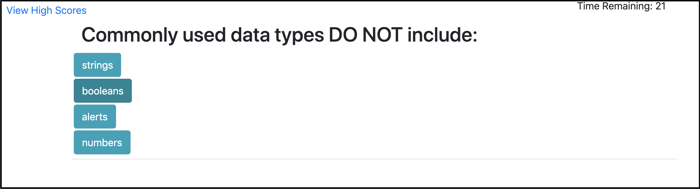
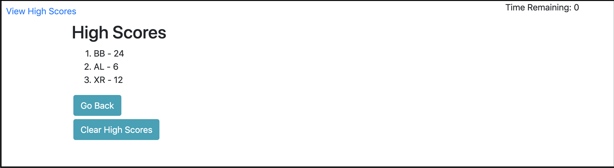

# Code Quiz Application

This is a timer-based code quiz with multiple-choice questions;.

* Click the "Start Quiz" button to begin the quiz, and the timer starts.

* During the quiz, if you answer a question incorrectly, ten seconds are subtracted from the timer.

* The timer will stop when all questions have been answered or the timer reaches 0.

* After the game ends, you can save initials and score to a highscores view, and these values are retained in local storage.

* In the High Scores page, you have the options to clear the high scores, and do the quiz again.
